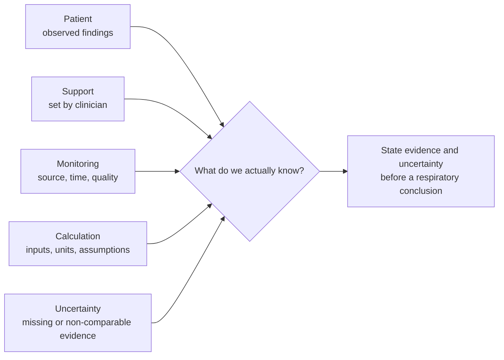

# Module 01 storyboard: patient, support, and respiratory evidence

> State: Generated draft. Original product-authored instructional asset; no clinical-ready label and no patient-specific recommendation.

## Source records

- [M01-CR-001: patient-ventilator assessment](../source-records/M01-CR-001-patient-ventilator-assessment.md)
- [M01-DS-001: provenance taxonomy](../source-records/M01-DS-001-provenance-taxonomy.md)
- [M01-DS-002: synthetic provenance case](../source-records/M01-DS-002-synthetic-provenance-case.md)

## Original visual explanation

Narration rule: explain that each layer can contribute to an assessment, but a layer is not interchangeable with another layer. Do not tell the learner to change support, infer a diagnosis, or delay urgent real-world reassessment.

## Worked synthetic case

All values are invented solely for source-classification practice. They are not a patient, protocol, target, or evidence for a treatment decision.

| Data supplied in the same labeled exercise window | Learner task |
| --- | --- |
| A programmed support rate: `16/min` | Label it as a set value. |
| A displayed total rate: `28/min` | Label it as a device-derived value and state that its source/time window matter. |
| A displayed mean exhaled tidal volume: `0.40 L`, labeled as the same time window | Identify the inputs that can be used for the arithmetic exercise. |
| A displayed oxygen saturation: `96%`, with no clinical interpretation supplied | State what source/quality/context would be needed before treating it as complete respiratory evidence. |
| No current carbon-dioxide result and no direct description of patient effort | Identify these as missing rather than inventing a value or conclusion. |

The arithmetic prompt is: `28/min × 0.40 L = ? L/min`.

The answer key may state only: `11.2 L/min` under the displayed, matched-window assumptions. It must then ask what this arithmetic does **not** establish. It must not present the result as a conclusion about alveolar ventilation, respiratory effort, safety, or an intervention.

## Reasoning checkpoint

Prompt:

> In 3–5 sentences, identify one set value, one device-derived value, and one missing or uncertain element in this synthetic case. Explain why the displayed arithmetic alone cannot settle the respiratory assessment.

Draft rubric:

1. Correctly distinguishes the programmed value from the displayed device-derived value.
2. Names one missing, source-dependent, or validity-dependent element instead of inventing it.
3. States that the arithmetic result is limited to its disclosed inputs and assumptions.

The final rubric wording, threshold, and feedback are not approved until qualified RT review.

## Targeted feedback paths

| Learner error | Draft targeted feedback |
| --- | --- |
| Uses the programmed rate as though it were the displayed total rate. | Recheck the source label: one number was programmed and the other was displayed for the exercise window. Which one did the calculation prompt supply as its rate input? |
| Treats the arithmetic result as a complete respiratory conclusion. | The calculation answers only the disclosed arithmetic question. Name one missing or validity-dependent element before drawing a broader conclusion. |
| Invents a carbon-dioxide value, effort finding, or treatment response. | That datum was not supplied in this synthetic case. State it as missing and explain why it would matter to the assessment. |

## Spaced transfer

Reuse the visual structure after changing exactly one declared condition:

- the device-derived value comes from a different time window;
- a signal-quality qualifier is added;
- the support setting changes after the displayed value; or
- a previously missing datum is supplied while another becomes uncertain.

The learner must again identify evidence source, comparability, and one consequential uncertainty before any explanation is revealed.
